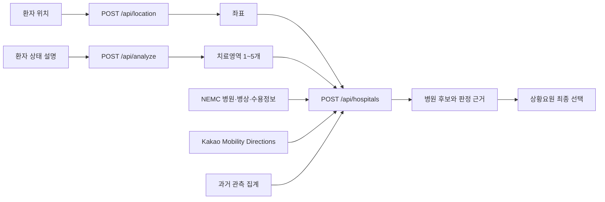

<div align="center">

<h1 align="center">
  
</h1>

**경상북도 119 상황요원의 이송병원 선정을 돕는 의사결정 보조 서비스**

보낼 송(送), 백성 민(民). 환자를 필요한 치료가 가능한 병원으로 잇는다는 뜻을 담았습니다.
심벌은 사방위 축의 중앙을 병원 십자로 강조하고, 한쪽 끝의 화살표로 병원을 향한 이송 방향을 표현했습니다.

환자 상태에서 필요한 치료영역을 구조화하고, NEMC 수용정보와 실제 도로 ETA를 결합해

확인 가능한 근거와 함께 병원 후보를 제시합니다.

[](https://nextjs.org/)
[](https://www.typescriptlang.org/)
[](https://ai.google.dev/)
[](LICENSE)

</div>

> 송민은 해커톤 MVP입니다. 의료행위, 병원 자동배정, 수용 확약을 제공하지 않으며 최종 판단은 119 상황요원이 수행합니다.

## 문제

경상북도는 넓은 생활권과 지역별 의료자원 편차로 인해 환자 위치, 필요한 최종치료, 병원의 현재 상태를 동시에 비교하기 어렵습니다. 상황요원은 제한된 시간 안에 여러 시스템의 정보를 확인하고 병원에 직접 수용 가능 여부를 문의해야 합니다.

송민은 이 과정에서 반복되는 정보 탐색을 하나의 콘솔로 모읍니다.

- 환자 설명을 공식 NEMC 치료영역으로 변환
- 경북과 인접 권역 병원의 수용정보를 `hpid` 기준으로 결합
- 실제 도로 이동시간을 계산해 후보 정렬
- 현재 응답과 과거 보고 패턴을 분리해 함께 제시
- 선택 결과를 통화 전 확인 가능한 이송 후보 요약으로 정리

## 동작 흐름

| 단계 | 상황요원 행동 | 시스템 처리 |
| --- | --- | --- |
| 1. 위치 확인 | 장소명 또는 도로명주소 선택 | Kakao Local, OpenStreetMap 보조 검색으로 좌표 확인 |
| 2. 환자 상태 설명 | 증상, 발생 시점, 활력징후, 특이사항 입력 | 입력 누락과 길이 검증 |
| 3. 필요 치료영역 | Gemini 초안을 검토하고 치료영역 복수 선택 | 공식 `MKioskTy1~27`과 입력 원문 근거만 반환 |
| 4. 병원 후보 선정 | 후보 비교 후 하나를 명시적으로 선택 | NEMC 상태 판정, Kakao ETA 계산, 결정론적 정렬 |



## 핵심 설계

### AI가 병원을 고르지 않습니다

Gemini의 역할은 환자 설명을 공식 치료영역으로 구조화하는 데 한정됩니다.

- 공식 `MKioskTy1~27` 밖의 치료영역 생성 금지
- 질환 확정, 확률, 병원 ID, 병원 추천 생성 금지
- 입력 문장에 실제 존재하는 연속된 문구만 근거로 허용
- 중복 코드와 원문에 없는 근거는 서버 스키마에서 거부
- AI 제안은 모두 미선택 상태이며 상황요원이 직접 확정

### 병원 판정은 명시적인 규칙으로 계산합니다

선택한 치료영역이 여러 개라면 모든 영역이 가능으로 보고되어야 `처치 가능`입니다.

| 화면 상태 | 판정 기준 |
| --- | --- |
| 처치 가능 | 응급실 게이트키퍼 가능, 가용병상 1개 이상, 선택 치료영역 모두 가능 |
| 확인 필요 | 명시적 불가는 없지만 게이트키퍼·병상·치료영역 중 정보미제공 존재 |
| 처치 불가 | 게이트키퍼 불가, 가용병상 0 이하 또는 선택 치료영역 중 하나 이상 불가 |

후보는 `처치 가능 → 확인 필요 → 처치 불가 → 실제 ETA → hpid` 순으로 정렬합니다. 동일한 입력과 데이터에는 항상 같은 결과가 나옵니다.

### 과거 이력은 현재 판정을 바꾸지 않습니다

NEMC 원본 XML에서 병원과 치료영역별 보고 패턴을 집계합니다.

- 가능·불가능·정보미제공 비율
- 상태 전환 횟수
- 첫 관측과 마지막 관측 시각
- 병상 보고값의 변경 횟수

과거 이력은 수용확률이나 예측값이 아닙니다. 현재 상태를 승격하거나 후보 순위를 변경하지 않고, 병원 확인 시 참고 근거로만 표시합니다.

## 데이터 범위

병원 후보는 경상북도와 인접한 6개 권역에서 조회합니다.

`경상북도`, `대구광역시`, `울산광역시`, `강원특별자치도`, `충청북도`, `경상남도`

API 호출량과 응답시간을 제어하기 위해 상태별 직선거리 순으로 경로 계산 대상을 제한합니다.

| 상태 | Kakao 경로 계산 상한 |
| --- | ---: |
| 처치 가능 | 8곳 |
| 확인 필요 | 10곳 |
| 처치 불가 | 4곳 |

## 사용 데이터

| 데이터·서비스 | 용도 |
| --- | --- |
| [전국 응급의료기관 정보 조회 서비스](https://www.data.go.kr/data/15000563/openapi.do) | 병원 기본정보, 가용병상, 응급실 및 중증질환 수용정보 |
| [119구급상황관리센터 운영 현황](https://www.data.go.kr/data/15089564/fileData.do) | 경상북도 문제 정의 배경 |
| [Google Gemini API](https://ai.google.dev/gemini-api/docs) | 환자 설명에서 공식 치료영역과 원문 근거 추출 |
| [Kakao Mobility Directions](https://developers.kakaomobility.com/docs/navi-api/directions/) | 병원별 도로거리와 ETA 계산 |
| Daum Postcode / Kakao Local | 도로명주소 선택과 좌표 확인 |
| OpenStreetMap Nominatim | Kakao Local 조회 실패 시 위치 보조 검색 |

### 실제 NEMC 응답에서 확인한 사항

- 병원 목록의 지역 파라미터는 `Q0`입니다.
- 병상과 수용정보는 시도 단위로 조회한 뒤 병원명이 아닌 `hpid`로 결합합니다.
- 수용정보 필드는 실제 응답의 `MKioskTy1~28` 표기를 사용합니다.
- `MKioskTy28`은 응급실 게이트키퍼이며 치료영역 선택 항목이 아닙니다.
- `Y`는 병원이 보고한 조회 시점의 값이며 실제 수용을 보장하지 않습니다.
- `N`, `N1`, `불가능`, `정보미제공`을 구분해 정규화합니다.
- 병상 기준시각 `hvidate`는 KST `YYYYMMDDHHMMSS` 형식입니다.

## 기술 스택

| 영역 | 기술 |
| --- | --- |
| Web | Next.js 16 App Router, React 19, TypeScript strict |
| AI | Google Gen AI SDK, Gemini 3.5 Flash Lite, JSON Schema |
| Validation | Zod 4 |
| Public API | NEMC OpenAPI, Kakao Mobility, Kakao Local |
| Location fallback | OpenStreetMap Nominatim |
| Data processing | Node.js, fast-xml-parser |
| Test | Vitest, ESLint, TypeScript |
| Deployment | Vercel |

## Vercel 배포

GitHub Pages는 서버 API와 비밀 환경변수를 실행할 수 없어 전체 기능 배포에 적합하지 않습니다.

1. [Vercel New Project](https://vercel.com/new)에서 이 GitHub 저장소를 Import합니다.
2. Framework Preset은 `Next.js`, Root Directory는 `./`를 사용합니다.
3. `NEMC_API_KEY`, `GEMINI_API_KEY`, `KAKAO_MOBILITY_REST_KEY`와 사용할 `GEMINI_MODEL`을 Production 환경에 등록합니다.
4. Build Command와 Output Directory는 Vercel 기본값을 유지합니다.
5. Deploy 후 `https://배포주소/api/health`가 `status: "ready"`인지 확인합니다.

환경변수를 배포 후 추가하거나 변경했다면 최신 Deployment를 Redeploy해야 합니다. API 키를 `NEXT_PUBLIC_` 변수나 저장소 파일에 넣지 마세요.

## API

| Method | 경로 | 입력 | 결과 |
| --- | --- | --- | --- |
| `GET` | `/api/health` | 없음 | 환경변수 준비 상태와 누락된 키 |
| `POST` | `/api/location` | 주소 또는 장소 문자열 | 정규화 주소, 이름, 좌표, 제공자 |
| `POST` | `/api/analyze` | 환자 상태 서술 | 공식 치료영역 1~5개와 원문 근거 |
| `POST` | `/api/hospitals` | 위치와 선택 치료영역 | NEMC 상태, 과거 이력, Kakao ETA가 결합된 후보 |

외부 API 오류는 성공 결과로 바꾸지 않습니다. 화면에 실패 원인을 표시하고 사용자가 재시도할 수 있게 합니다.

## 과거 관측 데이터 갱신

NEMC XML 원본을 비식별 파생 통계 `src/data/historical-metrics.json`으로 변환합니다.

```bash
npm run history:build -- --source "C:\path\to\data_sujip\data"
```

새 XML이 저장될 때 자동 갱신하려면 별도 터미널에서 실행합니다.

```bash
npm run history:watch -- --source "C:\path\to\data_sujip\data"
```

집계 키는 `hpid + MKioskTy 코드`입니다. `.env`, `service.json`, 원본 XML, 환자 개인정보는 앱이나 저장소에 포함하지 않습니다. 정적 집계 파일이 변경되면 다시 배포해야 서비스에 반영됩니다.

## 프로젝트 구조

```text
src/
├─ app/
│  ├─ api/
│  │  ├─ analyze/       # Gemini 치료영역 분석
│  │  ├─ hospitals/     # NEMC 결합, 상태 판정, ETA 정렬
│  │  ├─ location/      # 주소·장소 좌표 확인
│  │  └─ health/        # 서버 환경 점검
│  └─ globals.css       # 관제 콘솔 UI
├─ components/
│  ├─ dashboard.tsx     # 4단계 업무 흐름
│  └─ postcode-search.tsx
├─ data/
│  └─ historical-metrics.json
└─ lib/
   ├─ cache/            # 실패를 저장하지 않는 TTL 캐시
   ├─ history/          # 과거 관측 지표 검증
   ├─ nemc/             # NEMC OpenAPI 클라이언트
   ├─ routing/          # Kakao ETA와 거리 계산
   └─ transfer/         # 분석·병원 판정·요약 도메인

scripts/
├─ build-historical-metrics.mjs
└─ watch-historical-metrics.mjs
```

## 검증

```bash
npm test
npm run lint
npx tsc --noEmit
npm run build
```

테스트는 다음 경계를 포함합니다.

- Gemini 응답의 공식 치료영역 코드와 원문 근거 검증
- NEMC 상태 문자열 정규화
- 복수 치료영역의 모두 충족 조건
- 상태와 ETA 기반 결정론적 병원 정렬
- 위치 정규화와 캐시 동시 요청 처리
- 이송 후보 요약 생성

## 안전과 한계

- 이 서비스는 의료기기, 확정 진단 도구, 자동배정 시스템이 아닙니다.
- 환자 이름, 연락처, 주민등록번호 등 식별정보를 입력하지 마세요.
- NEMC 값은 기관이 보고한 조회 시점의 정보이며 도착 시 상태를 보장하지 않습니다.
- `정보미제공` 병원은 숨기지 않고 `확인 필요`로 표시합니다.
- 과거 관측 이력은 수용확률이나 미래 예측이 아닙니다.
- 외부 API의 지연, 장애, 쿼터와 갱신 주기에 영향을 받습니다.
- 실제 이송 전 의료진 및 병원과 수용 가능 여부를 확인해야 합니다.

## License

이 프로젝트는 [MIT License](LICENSE)로 배포됩니다.
