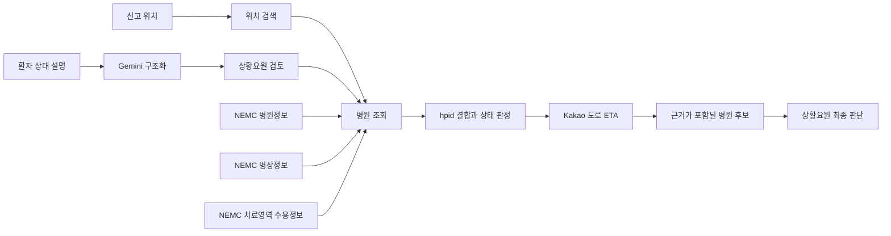

<div align="center">

<h1 align="center">
  
</h1>

**경상북도 119 상황요원을 위한 근거 기반 응급실 후보 조회 서비스**

응급실로는 환자에게 필요한 치료, 현재 병원 보고정보, 실제 도로 이동시간을
하나의 흐름으로 연결해 확인할 병원 후보를 빠르게 찾도록 돕습니다.

**한국어** · [English](./README_en.md)

[](https://nextjs.org/)
[](https://www.typescriptlang.org/)
[](https://ai.google.dev/)
[](LICENSE)

</div>

> [!IMPORTANT]
> 응급실로는 해커톤 MVP이자 의사결정 보조 도구입니다. 환자를 진단하거나
> 병원을 자동 배정하지 않으며 수용을 보장하지 않습니다. 실제 이송 전
> 상황요원이 병원에 직접 연락하고 최종 판단해야 합니다.

## 무엇을 할 수 있나요?

응급실로는 상황요원의 한 가지 핵심 업무를 돕습니다.

> 현장 보고를 필요한 치료영역으로 정리하고, 관련 응급실 후보를 비교한 뒤,
> 병원 확인 전화에 필요한 근거를 한곳에서 확인합니다.

응급실로는 다음 정보를 하나의 화면 흐름으로 연결합니다.

- 자유로운 환자 설명을 공식 NEMC 치료영역으로 구조화
- 병원·병상·치료영역 데이터를 공식 식별자 `hpid`로 결합
- 직선거리가 아닌 실제 도로 ETA로 병원 후보 비교
- 각 병원이 `처치 가능`, `확인 필요`, `처치 불가`로 판정된 이유 표시
- 현재 응답과 과거 보고 이력을 분리해 제공
- 통화에 활용할 수 있는 이송 후보 요약 생성

## 사용하기 전에

- **가로 1280px 이상**의 데스크톱 브라우저를 사용하세요.
- 합성 정보 또는 비식별 환자 정보만 입력하세요.
- 이름, 전화번호, 주민등록번호 등 개인을 식별할 수 있는 정보는 입력하지 마세요.
- NEMC 값은 병원이 특정 시점에 보고한 정보이며 수용 확약이 아닙니다.

## 응급실로 사용 방법

화면 왼쪽의 순서에 따라 네 단계를 진행합니다.

### 1. 신고 위치 확인

1. 건물명, 장소명, 역 이름 등을 입력한 뒤 **`장소명 검색`**을 누르거나,
   **`도로명주소 검색`**을 열어 주소를 찾습니다.
2. 올바른 검색 결과를 선택합니다.
3. 화면에 표시된 정규화 주소가 신고 위치와 일치하는지 확인합니다.
4. **`확인한 위치로 계속`**을 누릅니다.

확정된 좌표는 병원까지의 도로 경로를 계산하는 데 사용합니다.
위치 정보는 Gemini에 전송하지 않습니다.

### 2. 환자 상태 설명

이송 판단에 필요한 현장 정보를 간결하게 입력합니다.

- 주요 증상 또는 손상
- 증상 발생 시각 또는 사고 시각
- 의식 상태
- 확인 가능한 활력징후
- 그 밖의 임상적으로 중요한 관찰 내용

입력 예시:

```text
오른손 검지가 완전히 절단됨
사고 발생 약 20분, 출혈 지속
의식 명료
```

입력을 마쳤다면 **`AI 분석 시작`**을 누릅니다.

> [!TIP]
> 추측한 질환명보다 현장에서 직접 보거나 측정한 내용을 구체적으로 작성할수록
> 원문 근거를 확인하기 쉽습니다.

### 3. 필요 치료영역 검토

Gemini가 공식 NEMC 치료영역 중 1~5개를 제안하고, 각 제안을 뒷받침하는
환자 설명의 원문을 함께 표시합니다.

1. 치료영역과 제안 근거를 하나씩 확인합니다.
2. 병원 탐색에 사용할 치료영역만 직접 선택합니다.
3. 잘못된 제안은 선택하지 않습니다. 필요한 정보가 빠졌다면 환자 설명을
   수정한 뒤 다시 분석합니다.
4. **`선택한 치료영역으로 병원 찾기`**를 누릅니다.

AI가 제안한 치료영역은 자동으로 확정되지 않습니다. 최종 선택은 상황요원이
직접 수행합니다.

### 4. 병원 후보 비교 및 선택

병원 후보 목록에서 다음 정보를 확인할 수 있습니다.

- 현재 판정과 판정 이유
- Kakao 실시간 도로 ETA와 거리
- 응급실 가용병상과 NEMC 기준시각
- 선택한 치료영역별 병원 보고 상태
- 병원 종별, 주소, 응급실 전화번호
- 비식별 과거 보고 패턴

**`우선 검토`**에서는 현재 `처치 불가`로 보고되지 않은 후보만 확인할 수
있습니다. **`전체`**에서는 경로가 계산된 모든 후보를 확인할 수 있습니다.

병원 행을 선택하면 상세 근거가 열립니다. 적절한 후보라고 판단했다면:

1. **`이 후보 선택`**을 누릅니다.
2. 병원에 전화해 실제 수용 가능 여부를 확인합니다.
3. **`요약 복사`**를 눌러 위치, 환자 설명, 치료영역, 병원 상태, ETA,
   병상, 기준시각, 전화번호를 복사합니다.

복사된 내용은 통화를 돕는 이송 후보 요약이며 이송 명령서가 아닙니다.

## 상태 표시 읽는 방법

| 화면 상태 | 의미 | 필요한 행동 |
| --- | --- | --- |
| **처치 가능** | 응급실 게이트키퍼 가능, 응급실 병상 1개 이상, 선택 치료영역 모두 가능으로 보고됨 | 기준시각을 확인하고 병원에 전화 |
| **확인 필요** | 명시적 불가는 없지만 필요한 값 중 하나 이상이 정보미제공 | 누락된 정보를 병원에 전화로 확인 |
| **처치 불가** | 응급실 불가, 응급실 병상 없음 또는 선택 치료영역 중 하나 이상 불가 | 판정 이유를 확인한 뒤 후보 검토 |

> [!WARNING]
> **`처치 가능`은 `수용 확정`이 아닙니다.** NEMC의 `Y`는 병원이 해당
> 시점에 가능으로 보고했다는 뜻입니다. 환자 도착 전 상태가 달라질 수 있습니다.

병원 후보는 다음 순서로 정렬합니다.

1. 현재 판정
2. 실제 도로 ETA
3. 동일 조건에서의 결정론적 순서를 위한 `hpid`

이 순서는 검토를 돕기 위한 것이며 AI가 생성한 의료적 추천 순위가 아닙니다.

## 현재 데이터와 과거 데이터는 다릅니다

### 현재 데이터

현재 병원 판정에는 최신 NEMC 응답의 다음 항목을 사용합니다.

- 응급실 게이트키퍼 상태
- 응급실 가용병상
- 상황요원이 선택한 치료영역의 보고 상태

### 과거 관측 이력

반복 수집한 NEMC XML은 `hpid + 치료영역 코드` 단위로 집계합니다.
화면에서는 다음과 같은 참고 정보를 확인할 수 있습니다.

- 가능·불가·정보미제공 보고 비율
- 상태 전환 횟수
- 최초·마지막 관측시각
- 병상 보고값 변경 횟수

과거 값은 **수용확률이나 미래 예측값이 아닙니다.** 현재 상태를 승격하거나
병원 후보 순서를 변경하지 않습니다.

## AI는 어디에 사용하나요?

Gemini는 2단계와 3단계 사이에서만 사용합니다.

```text
비식별 환자 설명
→ 공식 NEMC 치료영역 1~5개
→ 환자 원문에 있는 정확한 근거
→ 상황요원 검토
```

서버는 다음 제한을 강제로 적용합니다.

- `MKioskTy1~27` 이외의 코드 반환 금지
- JSON Schema에 맞는 구조화 출력
- 중복 치료영역 코드 거부
- 환자 원문에 실제로 존재하지 않는 근거 문구 거부
- 질환 확정, 확률, pre-KTAS, 병원 ID, 병원 추천 생성 금지

병원 상태 판정과 후보 정렬은 Gemini가 아니라 명시적인 규칙, 공공데이터,
실제 도로 ETA로 처리합니다.

## 왜 경상북도 밖의 병원도 조회하나요?

경상북도는 면적이 넓고 응급의료 자원이 지역별로 고르게 분포하지 않습니다.
도 경계와 가까운 지역에서는 인접 시도의 병원이 더 적절한 후보일 수 있습니다.

응급실로는 다음 6개 권역을 조회합니다.

`경상북도`, `대구광역시`, `울산광역시`, `강원특별자치도`, `충청북도`,
`경상남도`

행정구역 안에서만 병원을 찾는 대신 경북 환자의 실제 광역 이송권을 반영한
범위입니다.

## 사용 데이터

| 데이터·서비스 | 용도 |
| --- | --- |
| [전국 응급의료기관 정보 조회 서비스](https://www.data.go.kr/data/15000563/openapi.do) | 병원 기본정보, 응급실 병상, 게이트키퍼 및 중증질환 수용정보 |
| [119구급상황관리센터 운영 현황](https://www.data.go.kr/data/15089564/fileData.do) | 경상북도 문제 정의 배경 |
| [Google Gemini API](https://ai.google.dev/gemini-api/docs) | 원문 근거가 연결된 치료영역 추출 |
| [Kakao Mobility Directions](https://developers.kakaomobility.com/docs/navi-api/directions/) | 실제 도로거리와 ETA 계산 |
| Daum Postcode·Kakao Local | 도로명주소와 장소 검색 |
| OpenStreetMap Nominatim | 위치 검색 보조 수단 |

## 기술 구조



| 영역 | 기술 |
| --- | --- |
| Web | Next.js 16 App Router, React 19, TypeScript strict |
| AI | Google Gen AI SDK, Gemini 3.5 Flash Lite, JSON Schema |
| 검증 | Zod 4 |
| 데이터 처리 | Node.js, fast-xml-parser |
| 공공·경로 API | NEMC OpenAPI, Kakao Mobility, Kakao Local |
| 테스트 | Vitest, ESLint, TypeScript |
| 배포 | Vercel |

## 안전과 한계

- 응급실로는 의료기기나 확정 진단 시스템이 아닙니다.
- 병원을 자동 배정하는 용도로 사용할 수 없습니다.
- 외부 API는 지연, 장애, 호출량 제한 또는 갱신 지연의 영향을 받을 수 있습니다.
- `정보미제공`은 숨기지 않고 `확인 필요`로 표시합니다.
- 과거 관측 이력은 미래의 수용 가능성을 예측하지 않습니다.
- 실제 이송 전 반드시 병원에 수용 가능 여부를 확인해야 합니다.

## License

이 프로젝트는 [MIT License](LICENSE)로 배포됩니다.
