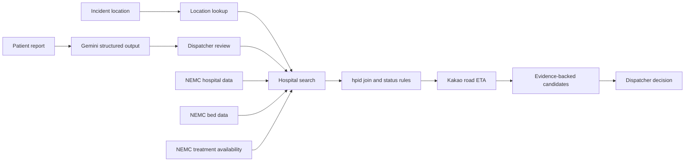

<div align="center">

<h1 align="center">
  
</h1>

**Evidence-backed ER candidate lookup for Gyeongsangbuk-do 119 dispatchers**

Eunggeupsillo (응급실로) literally means **"to the emergency room."**
It brings patient needs, current hospital reports, and road travel time into one
workflow so dispatchers can identify hospitals worth contacting faster.

[한국어](./README.md) · **English**

[](https://nextjs.org/)
[](https://www.typescriptlang.org/)
[](https://ai.google.dev/)
[](LICENSE)

</div>

> [!IMPORTANT]
> Eunggeupsillo is a hackathon MVP and a decision-support tool. It does not
> diagnose patients, assign hospitals, or guarantee acceptance. A dispatcher
> must contact the hospital and make the final decision before transport.

## What can I do with it?

Eunggeupsillo helps a dispatcher complete one focused task:

> Turn a field report into treatment requirements, compare relevant ER
> candidates, and keep the evidence needed for a confirmation call in one
> place.

The service:

- converts a free-form patient report into official NEMC treatment areas;
- combines hospital, bed, and treatment-availability data by the official
  `hpid` identifier;
- compares candidates using live road ETA rather than straight-line distance;
- shows why each hospital was classified as available, requiring verification,
  or unavailable;
- keeps historical reports separate from the current decision; and
- creates a copyable transfer-candidate summary.

## Before you begin

- Use a desktop browser at **1280 px or wider**.
- Enter only synthetic or de-identified patient information.
- Do not enter a name, phone number, resident registration number, or other
  identifying information.
- Remember that every NEMC value is a hospital-reported snapshot, not an
  acceptance confirmation.

## How to use Eunggeupsillo

The interface follows four steps from left to right.

### 1. Confirm the incident location

1. Enter a building, landmark, station, or place name and select
   **`장소명 검색` (Search place)**, or open
   **`도로명주소 검색` (Search road address)**.
2. Select the correct result.
3. Check the normalized address displayed by the service.
4. Select **`확인한 위치로 계속` (Continue with this location)**.

The confirmed coordinates are used to calculate road routes to hospitals.
They are not sent to Gemini.

### 2. Describe the patient's condition

Enter concise field notes, including only details relevant to transport:

- main symptom or injury;
- onset or accident time;
- consciousness;
- available vital signs; and
- clinically relevant observations.

Example:

```text
오른손 검지가 완전히 절단됨
사고 발생 약 20분, 출혈 지속
의식 명료
```

Select **`AI 분석 시작` (Start AI analysis)**.

> [!TIP]
> Concrete observations produce better evidence than a guessed diagnosis.
> Describe what was seen or measured.

### 3. Review the required treatment areas

Gemini proposes one to five official NEMC treatment areas and shows the exact
phrases from the patient report that support each proposal.

1. Read every treatment area and its evidence.
2. Select only the areas that should be used for the hospital search.
3. Leave an incorrect suggestion unselected. Revise the patient report and
   run the analysis again if required information was missing.
4. Select **`선택한 치료영역으로 병원 찾기` (Find hospitals)**.

AI suggestions are never confirmed automatically. The dispatcher controls the
final treatment-area selection.

### 4. Compare and select a hospital candidate

The hospital list shows:

- current classification and the reason for it;
- live Kakao road ETA and distance;
- emergency-bed count and NEMC update time;
- reported status for every selected treatment area;
- hospital tier, address, and ER phone number; and
- de-identified historical reporting patterns, when available.

Use **`우선 검토` (Priority review)** to see candidates that are not currently
reported unavailable. Use **`전체` (All)** to include every routed candidate.

Select a hospital row to open its evidence. If the candidate is appropriate:

1. select **`이 후보 선택` (Select this candidate)**;
2. call the hospital and confirm actual acceptance;
3. select **`요약 복사` (Copy summary)** to copy the location, patient report,
   treatment areas, hospital status, ETA, beds, timestamp, and phone number.

The copied summary is a communication aid, not a transfer order.

## How to read the status labels

| Korean UI label | Meaning | What you should do |
| --- | --- | --- |
| **처치 가능** | ER gatekeeper, at least one ER bed, and all selected treatment areas are reported available | Review the timestamp and call the hospital |
| **확인 필요** | Nothing is explicitly unavailable, but at least one required value is missing or unreported | Verify the missing information by phone |
| **처치 불가** | The ER is reported unavailable, no ER bed is reported, or at least one selected treatment area is unavailable | Review the reason before considering the hospital |

> [!WARNING]
> **처치 가능 does not mean "accepted."** NEMC `Y` means that the hospital
> reported availability at the recorded time. Conditions may change before
> arrival.

Candidates are ordered by:

1. current status;
2. live road ETA; and
3. `hpid` as a deterministic tie-breaker.

This order is a review aid, not an AI-generated medical recommendation.

## Current data and historical data are different

### Current data

Current hospital classification uses the latest available NEMC response for:

- emergency-room gatekeeper status;
- available ER beds; and
- the treatment areas selected by the dispatcher.

### Historical observations

Repeated NEMC XML snapshots are aggregated by `hpid + treatment-area code`.
The interface may show:

- available, unavailable, and unknown report ratios;
- status-transition counts;
- first and last observation times; and
- bed-report change counts.

Historical values are **not acceptance probabilities or forecasts**. They never
upgrade the current status or change candidate order.

## Where AI is used

Gemini is used only between steps 2 and 3:

```text
de-identified patient report
→ 1–5 official NEMC treatment areas
→ exact evidence quoted from the report
→ dispatcher review
```

The server enforces these boundaries:

- only `MKioskTy1–27` may be returned;
- structured JSON output is required;
- duplicate treatment codes are rejected;
- evidence must appear verbatim in the original report; and
- diagnosis, probability, pre-KTAS, hospital IDs, and hospital recommendations
  are prohibited.

Hospital classification and ordering use deterministic rules, public data, and
road ETA—not Gemini.

## Why the search extends beyond Gyeongsangbuk-do

Gyeongsangbuk-do has a large geographic area and unevenly distributed emergency
resources. For incidents near provincial borders, the most relevant hospital
may be in a neighboring region.

The service therefore searches:

`Gyeongsangbuk-do`, `Daegu`, `Ulsan`, `Gangwon`, `Chungcheongbuk-do`, and
`Gyeongsangnam-do`.

This represents Gyeongsangbuk-do's practical transfer area instead of stopping
at administrative boundaries.

## Data sources

| Data or service | Purpose |
| --- | --- |
| [National Emergency Medical Institution Information API](https://www.data.go.kr/data/15000563/openapi.do) | Hospital identity, ER beds, gatekeeper status, and severe-treatment availability |
| [119 Emergency Medical Consultation Center Operations](https://www.data.go.kr/data/15089564/fileData.do) | Background for the Gyeongsangbuk-do problem definition |
| [Google Gemini API](https://ai.google.dev/gemini-api/docs) | Evidence-linked treatment-area extraction |
| [Kakao Mobility Directions](https://developers.kakaomobility.com/docs/navi-api/directions/) | Road distance and ETA |
| Daum Postcode and Kakao Local | Road-address and place lookup |
| OpenStreetMap Nominatim | Fallback location lookup |

## Technical overview



| Area | Technology |
| --- | --- |
| Web | Next.js 16 App Router, React 19, strict TypeScript |
| AI | Google Gen AI SDK, Gemini 3.5 Flash Lite, JSON Schema |
| Validation | Zod 4 |
| Data processing | Node.js, fast-xml-parser |
| Public and route APIs | NEMC OpenAPI, Kakao Mobility, Kakao Local |
| Testing | Vitest, ESLint, TypeScript |
| Deployment | Vercel |

## Safety and limitations

- Eunggeupsillo is not a medical device or diagnostic system.
- It must not be used as an automatic hospital-assignment system.
- External APIs may be delayed, unavailable, rate-limited, or stale.
- `정보미제공` (not reported) is shown as **확인 필요**, never hidden.
- Historical observations do not predict future availability.
- Actual acceptance must be confirmed with the hospital before transport.

## License

This project is available under the [MIT License](LICENSE).
